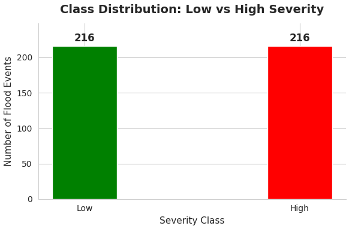
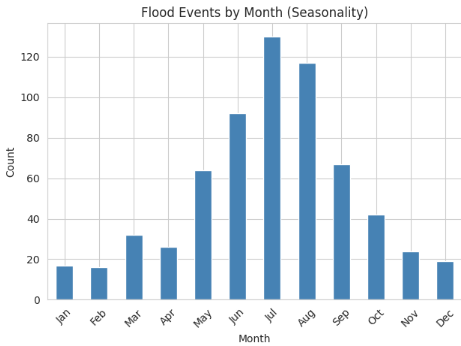
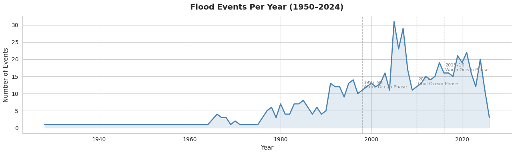
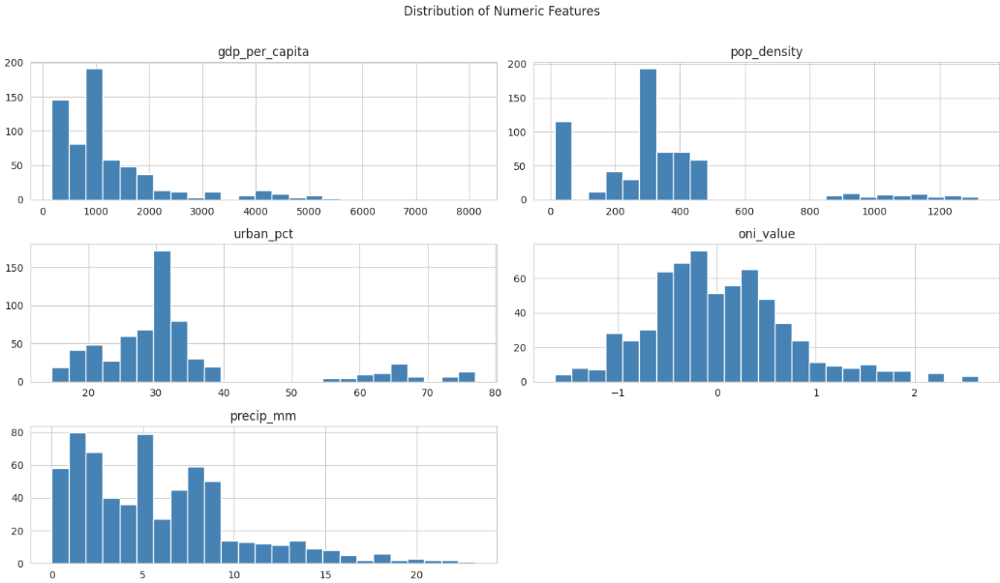
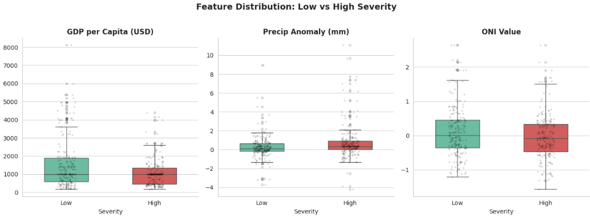
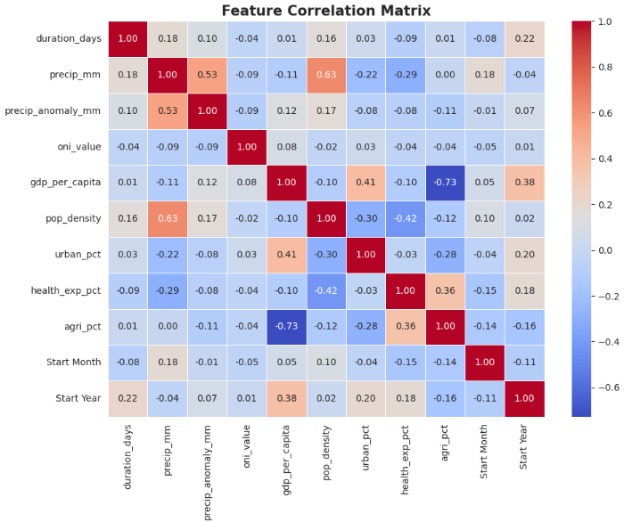
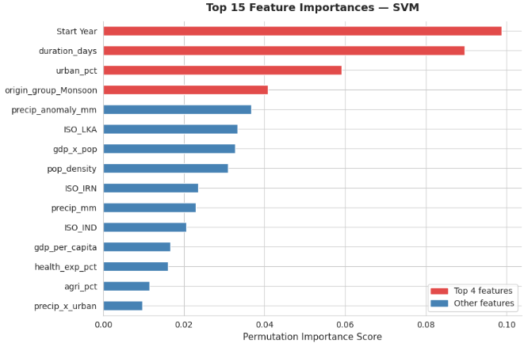

# 🌊 Flood Severity Prediction using Machine Learning

A machine learning project that predicts **Flood Severity (Low vs High)** across South and Central Asia by integrating historical disaster records, climate indicators, precipitation data, and socioeconomic features.

The project combines four real-world datasets and compares multiple machine learning models to identify the best approach for flood severity prediction.

---

# 📌 Overview

Floods are among the most devastating natural disasters in South and Central Asia. This project uses machine learning to predict whether a flood event will be **Low Severity** or **High Severity** using only pre-event information.

Instead of relying on post-disaster damage reports, the model utilizes climate patterns, rainfall measurements, and socioeconomic indicators to assist in early disaster preparedness.

---

# 🚀 Features

- Multi-source data integration
- Data preprocessing and cleaning
- Feature engineering
- Exploratory Data Analysis (EDA)
- Binary flood severity classification
- Comparison of multiple ML algorithms
- Feature importance analysis
- Model evaluation using cross-validation
- Real-world flood prediction

---

# 🛠 Technologies Used

- Python
- Pandas
- NumPy
- Scikit-learn
- XGBoost
- Matplotlib
- Seaborn
- Jupyter Notebook

---

# 📊 Dataset Sources

The project combines four publicly available datasets:

- EM-DAT Disaster Database
- World Bank World Development Indicators (WDI)
- NOAA Oceanic Niño Index (ONI)
- ERA5 Climate Reanalysis Dataset

Datasets are not included in this repository due to their size and licensing. They can be downloaded from their official sources.

---

# 🤖 Machine Learning Models

The following classification algorithms were trained and evaluated:

- Logistic Regression
- Support Vector Machine (SVM) ⭐ Best Model
- Random Forest
- XGBoost

---

# 📈 Results

| Model | Accuracy | F1 Score |
|--------|----------|----------|
| **Support Vector Machine (SVM)** ⭐ | **82.8%** | **82.8%** |
| Logistic Regression | 81.6% | 81.8% |
| Random Forest | 81.6% | 81.0% |
| XGBoost | 81.6% | 80.5% |

---

# 🏆 Best Model

**Support Vector Machine (SVM)** achieved the highest performance among all evaluated models.

- **Accuracy:** 82.8%
- **F1 Score:** 82.8%
- **Training Samples:** 345
- **Testing Samples:** 87
- **Features Used:** Top 20 selected features

The model was trained after feature engineering and feature selection, demonstrating strong capability in classifying flood events into **Low** and **High** severity categories.

---

# 📷 Project Visualizations

## Class Distribution



---

## Severity Distribution


---

## Flood Severity by Flood Type


---

## Monthly Flood Trends



---

## Temporal Trends



---

## Distribution of Numerical Features



---

## Feature Distribution (Box Plot)



---

## Correlation Heatmap



---

## Feature Importance



---

# 📌 Project Workflow

1. Collect data from four public datasets
2. Clean and preprocess data
3. Merge datasets
4. Engineer new features
5. Perform Exploratory Data Analysis
6. Select important features
7. Train multiple machine learning models
8. Evaluate model performance
9. Predict flood severity

---

# 📂 Repository Structure

```
flood-severity-prediction-ml/
│
├── notebook/
│   └── Flood_Severity_Prediction.ipynb
│
├── screenshots/
│   ├── box_plot.png
│   ├── class_distribution.png
│   ├── confusion_matrix.png
│   ├── correlation_heatmap.png
│   ├── dist_numeric_features.png
│   ├── feature_importance.png
│   ├── floods_by_month.png
│   ├── severity_distribution.png
│   ├── severity_dist_flood_type.png
│   └── temporal_trends.png
│
├── README.md
├── requirements.txt
└── .gitignore
```

---

# 🔮 Future Improvements

- Real-time flood prediction
- Satellite imagery integration
- River water level monitoring
- Deep Learning models
- Interactive prediction dashboard
